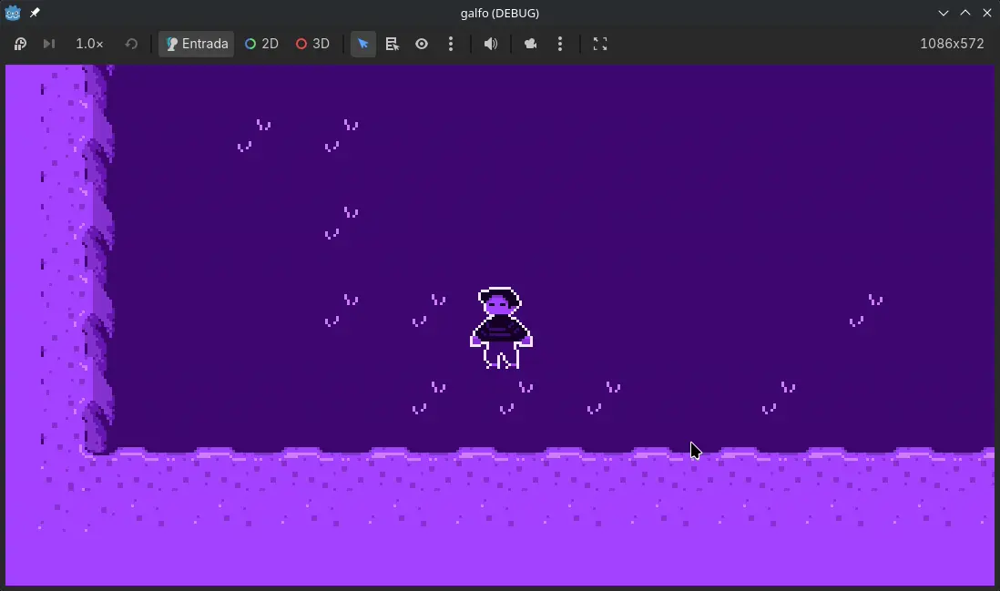

# Galfo

Galfo é um jogo 2D desenvolvido com objetivo de aprender mecânicas de roguelike.

## 🎮 Sobre o jogo

Neste projeto, o jogador controla um personagem em um mundo de tristeza, evitando enfrentar seu sofrimento.

As feridas não machucam tanto, quanto os pensamentos.

## 📸 Screencast



## 🚀 Tecnologias

- Godot Engine
- GDScript
- Pixel Art

## ▶️ Como executar

1. Clone este repositório:

```bash
git clone https://github.com/gitviini/galfo.git
```

2. Abra o projeto na Godot Engine.

3. Execute a cena principal (`main.tscn` ou equivalente).

## 🛠️ Status

Projeto em desenvolvimento.

## 📄 Licença

Este projeto está disponível sob a licença MIT.